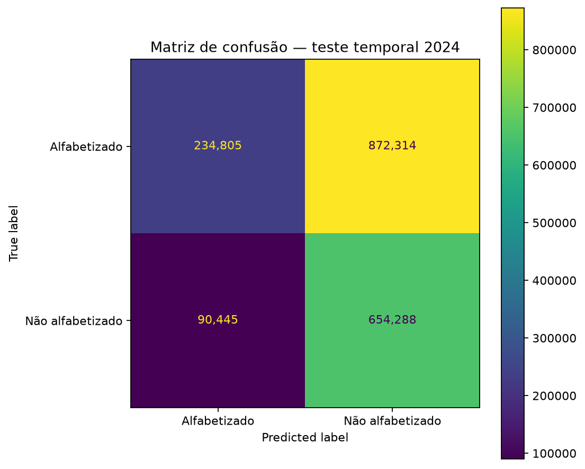
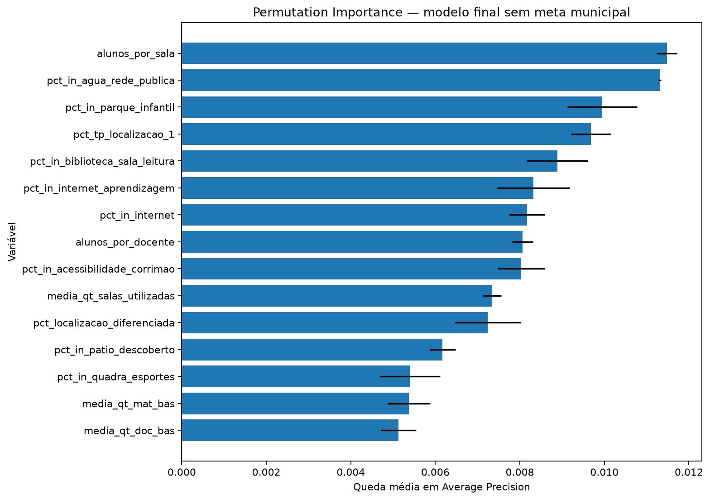
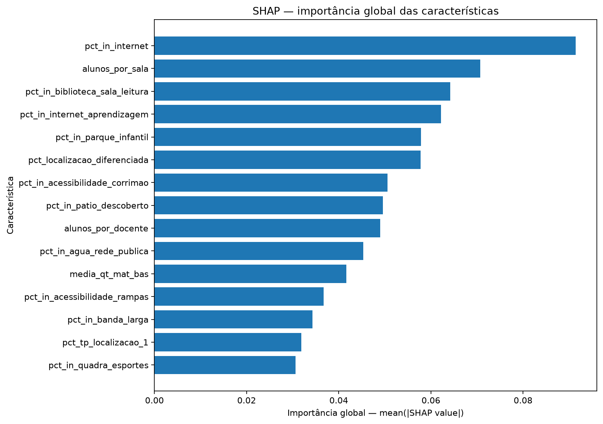
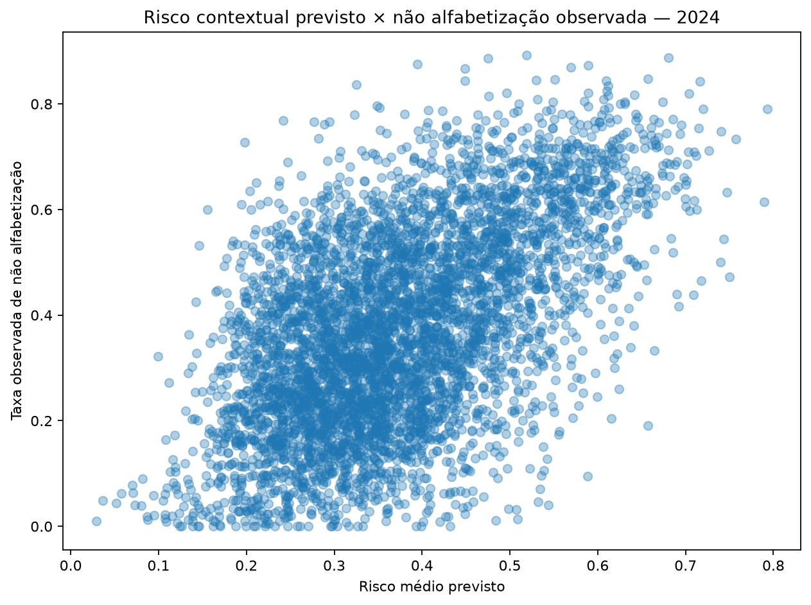
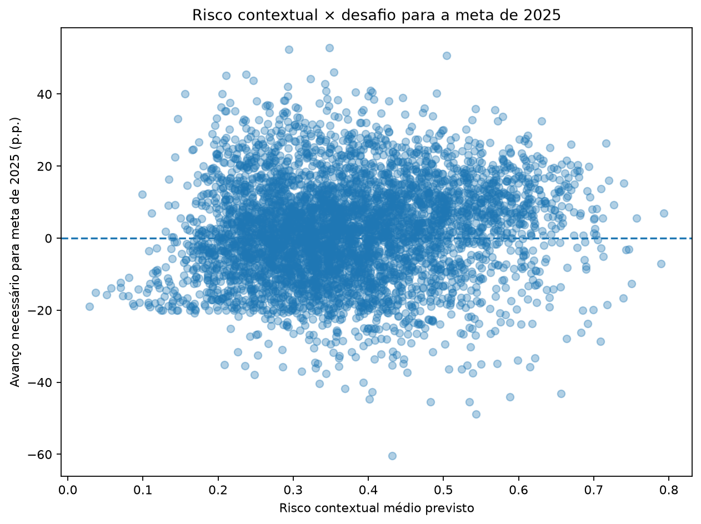
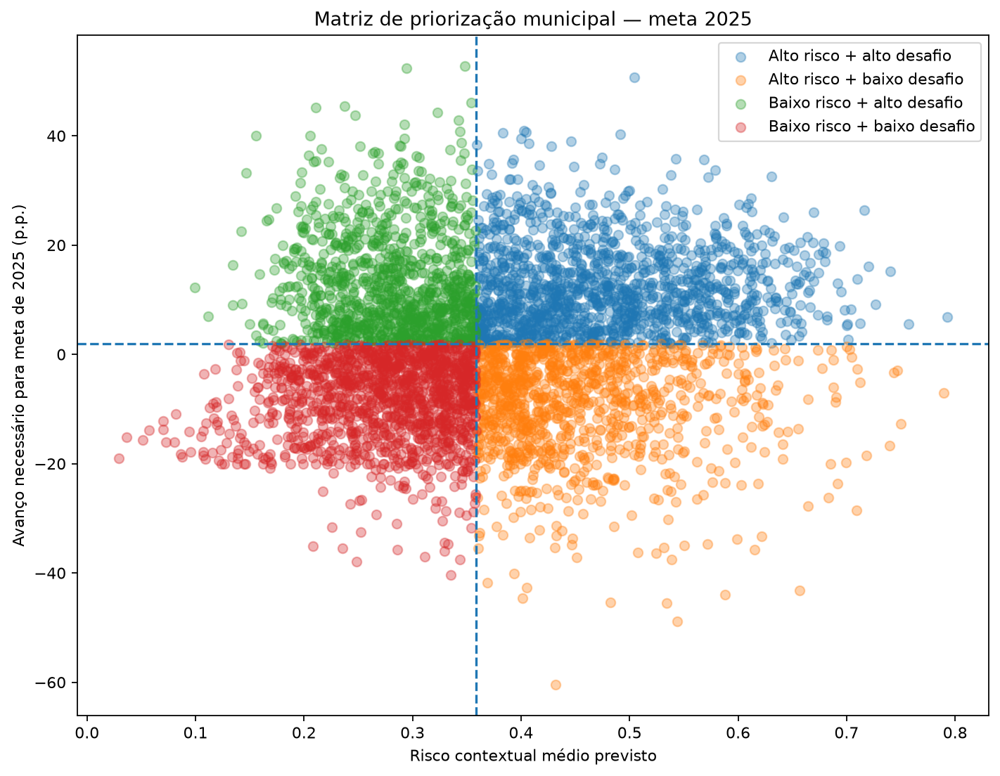

# Predição e Inteligência Analítica para Alfabetização no Brasil

Projeto desenvolvido para o **Tech Challenge — Fase 3**, com foco na aplicação de
Ciência de Dados e Machine Learning ao contexto da alfabetização infantil no Brasil.

A solução utiliza dados educacionais produzidos na Fase 2 e informações de
infraestrutura escolar do Censo Escolar para construir um modelo supervisionado
capaz de identificar alunos em risco de não alfabetização. As predições individuais
são posteriormente agregadas ao nível municipal e combinadas com análises de
interpretabilidade, segmentação e metas educacionais, transformando o modelo
preditivo em uma ferramenta de apoio à priorização de políticas públicas.

## Sumário

1. [Sobre o projeto](#1-sobre-o-projeto)
2. [Problema e objetivo](#2-problema-e-objetivo)
3. [Base de dados](#3-base-de-dados)
4. [Hipóteses analíticas](#4-hipóteses-analíticas)
5. [Metodologia](#5-metodologia)
6. [Modelo final](#6-modelo-final)
7. [Interpretabilidade](#7-interpretabilidade)
8. [Aplicação estratégica](#8-aplicação-estratégica)
9. [Principais resultados e insights](#9-principais-resultados-e-insights)
10. [Limitações](#10-limitações)
11. [Reprodutibilidade](#11-reprodutibilidade)
12. [Organização dos notebooks](#12-organização-dos-notebooks)
13. [Artefatos gerados](#13-artefatos-gerados)
14. [Versionamento e boas práticas](#14-versionamento-e-boas-práticas)
15. [Possíveis evoluções](#15-possíveis-evoluções)
16. [Tecnologias utilizadas](#16-tecnologias-utilizadas)
17. [Conclusão](#conclusão)

## 1. Sobre o projeto

A alfabetização infantil é um dos principais indicadores do desenvolvimento
educacional e social. Entretanto, observar apenas os resultados já realizados é
insuficiente para uma atuação preventiva: gestores públicos precisam identificar
antecipadamente situações de maior risco e compreender quais características do
contexto educacional estão associadas aos resultados observados.

Este projeto dá continuidade ao pipeline de Engenharia de Dados desenvolvido no
**Tech Challenge — Fase 2**, utilizando sua camada Gold como ponto de partida para
uma solução analítica de Machine Learning.

O trabalho foi estruturado em três etapas complementares:

1. **Análise exploratória e preparação para modelagem**, incluindo investigação
   explícita de data leakage e formulação de hipóteses analíticas;
2. **Modelagem supervisionada e interpretabilidade**, com validação temporal,
   otimização do modelo, ajuste do threshold e análise das características associadas
   às predições;
3. **Aplicação estratégica**, convertendo as predições individuais em indicadores
   municipais de risco e relacionando-os aos resultados observados, perfis de
   infraestrutura e metas de alfabetização.

O objetivo, portanto, não é apenas obter desempenho preditivo, mas transformar os
resultados do modelo em inteligência analítica aplicável ao contexto educacional.

## 2. Problema e objetivo

### Problema analítico

O problema principal é tratado como uma tarefa de **classificação binária
supervisionada**, em que cada observação representa um aluno e a variável-alvo
indica sua condição de alfabetização.

A modelagem foi orientada especialmente para a identificação da classe
**"Não alfabetizado"**, tratada como classe positiva do problema. Essa escolha
permite interpretar a probabilidade produzida pelo modelo como uma estimativa de
risco de não alfabetização.

### Objetivo principal

Desenvolver e validar um modelo de Machine Learning capaz de estimar o risco de um
aluno ser classificado como **não alfabetizado**, utilizando características
contextuais disponíveis sem incorporar ao modelo final informações que revelem
diretamente o desfecho.

### Objetivos complementares

Além da classificação individual, o projeto busca:

- identificar características com maior influência nas predições;
- avaliar a capacidade de generalização do modelo em um período posterior;
- investigar padrões de infraestrutura associados ao risco educacional;
- agregar as estimativas individuais para construir indicadores municipais;
- identificar municípios com maior risco contextual;
- confrontar risco previsto, resultado observado e metas futuras;
- produzir uma matriz de priorização que possa apoiar decisões de política pública.

## 3. Base de dados

### 3.1 Dados provenientes da Fase 2

O ponto de partida é a camada **Gold** construída no Tech Challenge da Fase 2,
baseada em dados públicos relacionados ao Indicador Criança Alfabetizada.

O dataset `alunos_modelagem.parquet` fornece a base individual utilizada nesta fase,
contendo registros de alunos dos anos de **2023 e 2024**, além de informações
educacionais e indicadores agregados incorporados anteriormente pelo pipeline de
Engenharia de Dados.

Essa continuidade preserva a separação de responsabilidades entre as fases:

**Fase 2 — Engenharia de Dados → Fase 3 — Ciência de Dados e Machine Learning**

### 3.2 Enriquecimento com o Censo Escolar

A base da Fase 2 foi enriquecida com informações públicas do **Censo Escolar**,
utilizadas para representar características do contexto e da infraestrutura escolar.

O enriquecimento considera informações como disponibilidade de água, energia,
esgoto, biblioteca, laboratórios, acesso à internet, equipamentos tecnológicos,
acessibilidade, espaços escolares e indicadores derivados de estrutura e capacidade
das escolas.

Para preservar a coerência temporal da análise, as informações contextuais são
associadas ao período educacional posterior:

- avaliação de **2023** ← Censo Escolar de **2022**;
- avaliação de **2024** ← Censo Escolar de **2023**.

Dessa forma, o enriquecimento utiliza características conhecidas anteriormente ao
desfecho analisado, reduzindo o risco de introdução de informação futura no processo
de modelagem.

### 3.3 Estratégia temporal

Os dois anos disponíveis possuem funções distintas no desenho experimental:

- **2023:** desenvolvimento do modelo, seleção de hiperparâmetros e definição do
  threshold;
- **2024:** teste temporal final, mantido fora das decisões de treinamento.

Essa separação permite avaliar o modelo em observações temporalmente posteriores
àquelas utilizadas durante seu desenvolvimento, aproximando a avaliação de um
cenário real de aplicação.

Dentro do conjunto de desenvolvimento de 2023, a validação cruzada também respeita
a estrutura dos dados, utilizando agrupamento por escola para impedir que alunos da
mesma escola sejam distribuídos entre treino e validação de um mesmo fold.

### 3.4 População de modelagem

Após as etapas de preparação, enriquecimento e seleção das variáveis adequadas ao
problema, a base utilizada pelo treinamento reproduzível contém:

| Componente | Quantidade |
|---|---:|
| Observações utilizadas | 3.354.661 |
| Desenvolvimento — 2023 | 1.502.809 |
| Teste temporal — 2024 | 1.851.852 |
| Features do modelo final | 36 |
| Escolas no desenvolvimento | 36.525 |

O conjunto final de atributos prioriza características contextuais e de infraestrutura
educacional. Variáveis identificadas como fontes de **data leakage** ou consideradas
inadequadas ao desenho preditivo final foram removidas durante o processo de
preparação e análise.

## 4. Hipóteses analíticas

Antes da modelagem, foram formalizadas cinco hipóteses analíticas para orientar a
análise exploratória, a seleção de variáveis, a interpretabilidade e a aplicação
estratégica do modelo. Cada hipótese foi posteriormente confrontada com evidências
produzidas ao longo dos notebooks.

| Hipótese | Como será investigada | Conclusão |
|---|---|---|
| **H1 — Infraestrutura escolar como fator contextual associado ao risco** | Avaliar a relevância e o comportamento das variáveis de infraestrutura por métodos complementares de interpretabilidade — Permutation Importance, SHAP e Partial Dependence — considerando que direção e magnitude das associações podem variar conforme o contexto territorial. | **Sustentada** |
| **H2 — Indicadores contemporâneos ao resultado configuram data leakage** | Comparar diretamente `alfabetizado`, `proficiencia` e variáveis derivadas do resultado da avaliação antes de qualquer modelagem. | **Confirmada** |
| **H3 — Meta municipal contém informação preditiva adicional, mas possui natureza contextual** | Avaliar separadamente a contribuição preditiva de `meta_alfabetizacao_2025` por análise de ablação, considerando sua natureza agregada e institucional antes da definição do conjunto final de features. | **Sustentada** |
| **H4 — Confusão por urbanização e porte** | Investigar se associações contraintuitivas encontradas na interpretabilidade são atenuadas após estratificação e controle por características contextuais dos municípios e escolas. | **Sustentada** |
| **H5 — Municípios com perfis semelhantes apresentam padrões de risco semelhantes** | Agrupar municípios por características contextuais e comparar os grupos quanto ao risco previsto e à taxa observada de não alfabetização, avaliando também a qualidade da separação obtida. | **Sustentada parcialmente** |

Os resultados mostram diferentes níveis de suporte às hipóteses. A investigação de
**H2** demonstrou diretamente o data leakage da variável `proficiencia`, cuja
correspondência com a definição do target justificou sua exclusão da modelagem.

Para **H1**, as análises de Permutation Importance e SHAP mostraram forte presença
das características de infraestrutura entre os atributos mais relevantes do modelo,
sustentando seu papel como fatores contextuais associados ao risco.

A análise de ablação relacionada à **H3** mostrou que a meta municipal contém
informação preditiva. Entretanto, por se tratar de um indicador agregado de política
pública e não de uma característica individual do aluno, foi adotada a decisão
conservadora de excluí-la do modelo final.

A investigação de **H4** mostrou que associações inicialmente contraintuitivas de
algumas características de infraestrutura foram fortemente atenuadas após considerar
localização e porte municipal. O resultado reforça que as relações aprendidas pelo
modelo não devem ser interpretadas isoladamente como efeitos causais.

Por fim, **H5 recebeu suporte parcial**. Os clusters construídos exclusivamente a
partir das características contextuais apresentaram diferenças coerentes de risco
previsto e de não alfabetização observada. Entretanto, o baixo coeficiente de
silhouette (**0,1882**) indica separação limitada entre os perfis, não permitindo
interpretá-los como grupos municipais rigidamente distintos.

As evidências completas e os experimentos utilizados para avaliar cada hipótese
estão documentados nos notebooks `01_eda_alunos_modelagem.ipynb`,
`02_preparacao_modelagem.ipynb` e `03_aplicacao_estrategica.ipynb`.

## 5. Metodologia

A metodologia foi estruturada para preservar a separação temporal dos dados,
reduzir riscos de data leakage e avaliar a capacidade de generalização do modelo
para um período posterior ao utilizado durante seu desenvolvimento.

O fluxo experimental pode ser resumido em:

**EDA → seleção de variáveis → separação temporal → validação cruzada → comparação
de modelos → otimização → ablação → definição do threshold → teste temporal →
interpretabilidade**

### 5.1 Análise exploratória

A análise exploratória foi conduzida no notebook
`01_eda_alunos_modelagem.ipynb` com o objetivo de compreender a estrutura da base,
avaliar sua qualidade, investigar a variável-alvo e identificar riscos metodológicos
antes da modelagem.

Além das análises descritivas, a EDA foi utilizada para:

- avaliar valores ausentes e características da população;
- investigar a distribuição da variável `alfabetizado`;
- analisar diferenças entre redes e períodos;
- identificar variáveis potencialmente redundantes;
- investigar explicitamente fontes de data leakage;
- avaliar os produtos analíticos provenientes da Fase 2;
- planejar e validar o enriquecimento com o Censo Escolar;
- formular as hipóteses analíticas que orientaram as etapas seguintes.

### 5.2 Prevenção de data leakage

A seleção das variáveis considerou explicitamente o momento em que cada informação
estaria disponível em relação ao desfecho que se pretende prever.

Variáveis contemporâneas ao resultado ou capazes de revelar diretamente a condição
de alfabetização foram excluídas do conjunto preditivo.

O caso mais evidente foi `proficiencia`. A análise exploratória demonstrou
correspondência exata entre a classificação `alfabetizado` e o ponto de corte de
743 pontos de proficiência. Por esse motivo, sua utilização produziria uma estimativa
artificialmente otimista da capacidade preditiva do modelo.

Também foram separados identificadores, variáveis operacionais, características
utilizadas apenas para auditoria e informações inadequadas ao momento da previsão.

### 5.3 Engenharia e seleção de atributos

Após o enriquecimento com o Censo Escolar, as variáveis foram classificadas
funcionalmente antes da definição do conjunto preditivo:

- variável-alvo;
- variáveis de controle;
- identificadores;
- exclusões por leakage ou razão operacional;
- candidatas provenientes da Gold;
- candidatas provenientes do Censo Escolar;
- variáveis mantidas apenas para auditoria.

Foram excluídas características constantes, estruturalmente redundantes e métricas
de cobertura utilizadas somente para controle de qualidade.

A variável categórica `rede` foi preservada, assim como características contextuais
relacionadas à infraestrutura, recursos escolares, acessibilidade, conectividade,
porte e capacidade das escolas.

A meta municipal de alfabetização foi inicialmente mantida como candidata para que
sua contribuição pudesse ser investigada posteriormente por meio de análise de
ablação. Após esse experimento, ela foi removida do modelo definitivo.

O pré-processamento foi integrado diretamente ao pipeline do modelo. As **35
variáveis numéricas** são imputadas pela mediana, enquanto a variável categórica
`rede` é imputada pela categoria mais frequente e transformada por
`OneHotEncoder(handle_unknown="ignore", drop="first")`.

Não foi aplicada padronização às variáveis numéricas no modelo final, uma vez que o
`HistGradientBoostingClassifier` é baseado em árvores e não depende da escala das
features.

O modelo final utiliza **36 features**.

### 5.4 Separação temporal

Conforme apresentado na seção 3.3, **2023** foi utilizado para desenvolvimento e
**2024** foi reservado como teste temporal final.

Do ponto de vista da modelagem, a restrição central foi manter 2024 completamente
fora das decisões experimentais: seleção de características, otimização de
hiperparâmetros e definição do threshold foram realizadas exclusivamente com dados
de 2023. O conjunto de 2024 foi utilizado apenas para a avaliação temporal final,
sem reotimização posterior a partir de seus resultados.


### 5.5 Validação cruzada

Dentro do conjunto de desenvolvimento de 2023 foi utilizado
`StratifiedGroupKFold` com **5 folds**, agrupando os registros por `id_escola`.

A estratégia atende simultaneamente a dois objetivos:

1. impedir que alunos pertencentes à mesma escola apareçam nos conjuntos de treino
   e validação de um mesmo fold;
2. buscar preservar a distribuição da variável-alvo entre os folds.

O agrupamento reduz o risco de resultados excessivamente otimistas decorrentes do
compartilhamento do mesmo contexto escolar entre treino e validação.

### 5.6 Modelos avaliados

Três referências foram utilizadas durante a comparação inicial:

| Modelo | Papel no experimento |
|---|---|
| `DummyClassifier` | Baseline sem capacidade discriminativa |
| Regressão Logística | Referência supervisionada linear e interpretável |
| `HistGradientBoostingClassifier` | Modelo não linear capaz de representar interações e relações mais complexas |

O baseline apresentou ROC-AUC de **0,50**, como esperado.

Na validação cruzada de 2023, a Regressão Logística alcançou ROC-AUC médio de
aproximadamente **0,680** e Average Precision de **0,588**.

O `HistGradientBoostingClassifier` apresentou desempenho ligeiramente superior,
com ROC-AUC médio de aproximadamente **0,684** e Average Precision de **0,590**,
além de maior recall para a classe positiva de risco.

Diante desses resultados, o HistGradientBoosting foi selecionado para a etapa de
otimização.

### 5.7 Otimização de hiperparâmetros

A otimização foi realizada exclusivamente sobre o conjunto de desenvolvimento de
2023.

Foi utilizado `RandomizedSearchCV`, mantendo o `StratifiedGroupKFold` como
estratégia de validação e utilizando **Average Precision** como métrica de
otimização.

A escolha dessa métrica está relacionada ao objetivo do problema: avaliar a
capacidade do modelo de ordenar e identificar observações pertencentes à classe
positiva `Não alfabetizado`, sem depender previamente de um limiar fixo de
classificação.

A primeira otimização, ainda com a meta municipal entre as características,
produziu Average Precision médio de **0,5922**.

### 5.8 Análise de ablação

A primeira análise de interpretabilidade revelou forte predominância de
`meta_alfabetizacao_2025` sobre as demais características.

Como essa variável representa uma meta territorial de política educacional, e não
uma característica individual do aluno ou substantiva da infraestrutura escolar,
foi realizado um teste de ablação para medir sua contribuição ao desempenho.

Sua remoção provocou redução da capacidade discriminativa do modelo, demonstrando
que a meta continha informação preditiva relevante.

Ainda assim, optou-se por excluí-la do modelo definitivo para evitar que uma meta
territorial dominasse as previsões e para concentrar a interpretação nas
características contextuais provenientes do Censo Escolar.

Após a exclusão, o HistGradientBoosting foi novamente otimizado utilizando apenas
os dados de desenvolvimento de 2023.

O modelo definitivo alcançou **Average Precision médio de 0,5659** na validação
cruzada.

As metas não foram descartadas do projeto: elas foram reservadas para a etapa
posterior de aplicação estratégica municipal.

### 5.9 Definição do threshold

O limiar padrão de `0,5` não foi adotado automaticamente.

Após a definição do modelo final, foram produzidas probabilidades
**out-of-fold (OOF)** para os registros de desenvolvimento de 2023. Essas
probabilidades permitiram selecionar o threshold sem utilizar o conjunto temporal
de 2024.

O critério adotado foi a maximização do **F1-score** da classe positiva
`Não alfabetizado`.

O threshold selecionado foi:

**0,2977**

No conjunto OOF de 2023, esse limiar resultou aproximadamente em:

| Métrica | Resultado |
|---|---:|
| Precision | 0,4688 |
| Recall | 0,8901 |
| F1-score | 0,6141 |

A escolha privilegia uma elevada capacidade de identificação dos alunos em risco,
aceitando como contrapartida uma redução de precision.

O threshold permaneceu fixo durante toda a avaliação temporal de 2024.

## 6. Modelo final

Após a comparação dos algoritmos, otimização de hiperparâmetros e análise de
ablação, o modelo definitivo foi construído com
`HistGradientBoostingClassifier`, utilizando **36 features** e sem a variável
`meta_alfabetizacao_2025`.

A classe **"Não alfabetizado"** é tratada como classe positiva. Dessa forma, a
probabilidade da classe positiva produzida pelo modelo representa o risco estimado
de não alfabetização.

### 6.1 Configuração final

A configuração selecionada exclusivamente com os dados de desenvolvimento de 2023
foi:

| Parâmetro | Valor |
|---|---:|
| Algoritmo | `HistGradientBoostingClassifier` |
| `learning_rate` | 0,10 |
| `max_iter` | 200 |
| `max_leaf_nodes` | 63 |
| `l2_regularization` | 0,0 |
| `random_state` | 42 |
| Número de features | 36 |
| Threshold | 0,2977 |

O pré-processamento e o estimador são encapsulados em um `Pipeline` do
scikit-learn. O modelo persistido também incorpora o threshold operacional por meio
de `ThresholdedBinaryClassifier`, permitindo que `predict()` reproduza diretamente
a regra de classificação definida durante o desenvolvimento.

O artefato é salvo localmente em:

`model/modelo_final.joblib`

O arquivo do modelo não é versionado no Git, mas o diretório é preservado no
repositório por meio de `.gitkeep`.

### 6.2 Desempenho no teste temporal de 2024

O modelo final foi treinado com os dados de 2023 e avaliado uma única vez sobre o
conjunto temporal de 2024, composto por **1.851.852 observações**.

O threshold de **0,2977**, previamente definido a partir das previsões out-of-fold
de 2023, foi mantido sem qualquer ajuste sobre o teste temporal.

Os resultados obtidos foram:

| Métrica | Resultado |
|---|---:|
| ROC-AUC | **0,6031** |
| Average Precision | **0,5002** |
| Balanced Accuracy | **0,5453** |
| Precision | **0,4286** |
| Recall | **0,8786** |
| F1-score | **0,5761** |

Os resultados mostram uma redução de desempenho em relação à validação de
desenvolvimento, evidenciando a dificuldade de generalização para um período
posterior. Essa diferença é mantida de forma explícita na avaliação, sem
reotimização do modelo ou do threshold a partir dos dados de 2024.

### 6.3 Matriz de confusão

A aplicação do threshold definido em 2023 produz uma estratégia de classificação
orientada à sensibilidade para a classe de interesse.



O **recall de 0,8786** indica que aproximadamente **87,9% dos alunos efetivamente
classificados como não alfabetizados em 2024 foram identificados pelo modelo como
casos de risco**.

Por outro lado, a **precision de 0,4286** mostra que parte relevante dos alunos
sinalizados como risco não pertence à classe positiva observada. Esse comportamento
é consequência do compromisso assumido na seleção do threshold: aumentar a
capacidade de identificação dos casos de risco ao custo de um maior número de
falsos positivos.

### 6.4 Interpretação das métricas

As métricas devem ser interpretadas de acordo com o objetivo da aplicação.

O projeto não utiliza o modelo como mecanismo automático de decisão sobre alunos.
Seu objetivo é produzir um **sinal de risco** que possa apoiar análises e ações
preventivas.

Nesse contexto:

- **Recall** mede a capacidade de recuperar alunos pertencentes à classe de risco;
- **Precision** indica a proporção dos alertas emitidos que correspondem à classe
  positiva observada;
- **F1-score** sintetiza o equilíbrio entre precision e recall no threshold
  operacional escolhido;
- **Balanced Accuracy** avalia o desempenho considerando igualmente as duas classes;
- **ROC-AUC** avalia a capacidade discriminativa do modelo independentemente de um
  threshold específico;
- **Average Precision** resume a relação entre precision e recall ao longo dos
  diferentes limiares de decisão.

A queda observada entre a validação de 2023 e o teste temporal de 2024 também
reforça que o modelo não deve ser interpretado como uma regra determinística de
alfabetização. Seu uso mais adequado é como instrumento de **triagem e priorização
de risco**, complementado por informações educacionais e territoriais adicionais.

## 7. Interpretabilidade

A interpretabilidade foi realizada após a definição do modelo final, utilizando
técnicas complementares para investigar quais características participam das
predições e como elas se relacionam com o risco estimado de não alfabetização.

Foram utilizadas três abordagens principais:

- **Permutation Importance:** avalia quanto o desempenho preditivo diminui quando
  a informação de uma característica é perturbada;
- **SHAP:** decompõe as previsões do modelo em contribuições atribuídas às
  características;
- **Partial Dependence:** permite observar o comportamento médio da predição
  quando determinadas características são variadas.

Essas técnicas possuem objetivos diferentes e não precisam produzir resultados
idênticos. A análise conjunta permite avaliar a consistência das evidências e
reduzir a dependência de um único método de interpretação.

As interpretações apresentadas são **associativas e preditivas**. Elas descrevem
o comportamento aprendido pelo modelo e não constituem evidência de relações
causais entre características escolares e alfabetização.

### 7.1 Permutation Importance

A Permutation Importance foi inicialmente utilizada durante o desenvolvimento
para avaliar a dependência do desempenho em relação às características.

A análise também teve papel importante na decisão de remover
`meta_alfabetizacao_2025`, que apresentava predominância sobre as demais variáveis.
Após a ablação e a reotimização, a importância do modelo definitivo mostrou-se
distribuída entre diferentes dimensões do contexto escolar.

Entre as características de maior relevância aparecem aspectos relacionados à
organização das turmas, infraestrutura, localização, disponibilidade de recursos,
conectividade e relação entre alunos e docentes.



A importância representa a perda de desempenho causada pela perturbação da
característica e não indica, isoladamente, a direção de sua associação com o risco.

### 7.2 SHAP

O SHAP foi utilizado como abordagem complementar para analisar tanto a importância
global quanto a direção predominante das contribuições das características.

Como a classe positiva do modelo corresponde a **não alfabetizado**:

- valores SHAP positivos deslocam a saída do modelo em direção a maior risco;
- valores SHAP negativos deslocam a saída na direção oposta.



A análise mostrou que o modelo utiliza múltiplas dimensões do contexto escolar, em
vez de depender de uma única característica dominante.

Características relacionadas à organização da rede e das turmas, como
`alunos_por_sala` e `alunos_por_docente`, aparecem entre aquelas associadas ao
comportamento de maior risco previsto.

Por outro lado, diversas características relacionadas à infraestrutura e aos
recursos escolares — incluindo internet, biblioteca ou sala de leitura, parque
infantil, acessibilidade e quadra de esportes — apresentam associação predominante
com menor risco previsto.

### 7.3 Partial Dependence

Os gráficos de Partial Dependence foram utilizados para aprofundar a análise da
forma das relações aprendidas pelo modelo para características selecionadas.

Foram analisadas:

- `alunos_por_sala`;
- `pct_in_agua_rede_publica`;
- `pct_in_parque_infantil`.

Os resultados foram confrontados com a direção identificada pelo SHAP.

Para as três características, a direção observada no Partial Dependence mostrou-se
consistente com a interpretação obtida pelo SHAP, oferecendo uma segunda
perspectiva sobre o comportamento do modelo.

Os gráficos correspondentes estão disponíveis em `images/`:

- `partial_dependence_alunos_por_sala.png`;
- `partial_dependence_pct_in_agua_rede_publica.png`;
- `partial_dependence_pct_in_parque_infantil.png`.

### 7.4 Convergência das evidências

A consistência entre SHAP e Permutation Importance foi avaliada quantitativamente,
comparando os rankings globais das características.

Os resultados foram:

| Comparação | Resultado |
|---|---:|
| Correlação de Spearman entre os rankings | **0,8905** |
| Sobreposição entre as 10 mais importantes | **80,0%** |
| Sobreposição entre as 15 mais importantes | **86,7%** |

Além da elevada concordância entre SHAP e Permutation Importance, as três
características investigadas por Partial Dependence apresentaram direção consistente
com o SHAP.

A convergência entre métodos com propriedades distintas aumenta a robustez da
interpretação do comportamento preditivo do modelo e sustenta **H1**, segundo a
qual características de infraestrutura escolar constituem fatores contextuais
relevantes para a estimativa de risco.

### 7.5 Associações contraintuitivas

Algumas características exigiram investigação adicional antes de qualquer
interpretação substantiva.

Em particular, `pct_in_agua_rede_publica` e `pct_in_banda_larga` apresentaram no
modelo associações que poderiam levar a uma leitura contraintuitiva das condições
de infraestrutura.

Por esse motivo, essas relações foram confrontadas com:

- a taxa observada de não alfabetização;
- localização dos municípios;
- medidas relacionadas ao porte municipal;
- análises estratificadas;
- correlações parciais com controles contextuais.

Após considerar simultaneamente localização e porte municipal, as associações
tornaram-se próximas de zero.

Esse resultado indica que os sinais identificados pelo modelo devem ser
interpretados dentro da estrutura multivariada e das correlações existentes nos
dados. Uma característica importante para a predição não deve ser interpretada
isoladamente como causa de aumento ou redução da alfabetização.

Consequentemente, os resultados de interpretabilidade são utilizados como
**dimensões para diagnóstico e investigação**, e não como prescrição automática
de intervenções educacionais.

## 8. Aplicação estratégica

A etapa de aplicação estratégica transforma as probabilidades produzidas pelo modelo
individual em informações territoriais voltadas ao diagnóstico e à priorização
educacional.

O objetivo não é utilizar a classificação como decisão automática sobre estudantes
ou municípios, mas combinar diferentes perspectivas analíticas para responder às
questões estratégicas do Tech Challenge.

### 8.1 Risco educacional municipal

As probabilidades individuais de não alfabetização foram agregadas por município,
utilizando a média das probabilidades previstas entre os alunos avaliados.

A análise mostrou que as probabilidades apresentam pouca variação entre alunos de
um mesmo município. Por esse motivo, a medida resultante é interpretada como
**risco contextual municipal**, e não como instrumento de avaliação individual dos
estudantes.

A validade dessa agregação foi investigada comparando o risco médio previsto com a
taxa observada de não alfabetização em 2024.



A correlação de Spearman entre as duas medidas foi de **0,5312**, indicando
associação positiva: municípios classificados com maior risco pelo modelo tendem
também a apresentar maiores taxas observadas de não alfabetização.

O indicador permite, portanto, ordenar territórios segundo a vulnerabilidade
contextual identificada pelo modelo e apoiar a seleção de municípios para
diagnóstico e acompanhamento mais detalhado.

### 8.2 Perfis municipais semelhantes

Para complementar o ranking de risco com uma perspectiva estrutural, foi realizada
uma análise não supervisionada utilizando características contextuais dos municípios.

A clusterização foi construída **sem utilizar o risco previsto ou o resultado
observado na formação dos grupos**.

Também foram removidas medidas absolutas de equipamentos quando havia medidas
normalizadas correspondentes, reduzindo a influência direta do porte municipal
sobre a segmentação.

As características foram padronizadas e diferentes números de clusters foram
avaliados por inércia e Silhouette Score. A solução com **dois clusters** apresentou
o melhor silhouette entre as configurações testadas:

**Silhouette Score = 0,1882**

Foram identificados:

| Perfil | Municípios | Risco médio previsto | Não alfabetização observada |
|---|---:|---:|---:|
| **Cluster 0** | 3.574 | 33,01% | 33,27% |
| **Cluster 1** | 1.943 | 44,77% | 43,79% |

O Cluster 0 apresenta, em média, maior disponibilidade de diferentes características
relacionadas à infraestrutura e aos recursos escolares. O Cluster 1 apresenta
valores inferiores em várias das características que mais diferenciam os grupos e
maior nível médio de risco educacional.

A separação entre os clusters, entretanto, é limitada. Os grupos não devem ser
interpretados como categorias naturais ou rígidas de municípios, mas como
**perfis contextuais exploratórios** úteis para comparação e diagnóstico.

Esse resultado oferece suporte parcial à hipótese H5.

### 8.3 Priorização frente à meta de 2025

A questão sobre municípios que podem não atingir metas futuras exigiu um cuidado
metodológico adicional.

A análise mostrou que a probabilidade produzida pelo modelo **não deve ser
convertida diretamente em uma previsão da taxa futura de alfabetização**. Uma
formulação exploratória inicialmente avaliada apresentou limitações e foi rejeitada.

A abordagem definitiva utiliza duas dimensões distintas:

1. **risco contextual:** probabilidade média prevista de não alfabetização no
   município;
2. **desafio frente à meta:** avanço necessário entre a taxa observada de
   alfabetização em 2024 e a meta municipal estabelecida para 2025.

A associação entre as duas dimensões é baixa:

**Spearman = 0,1377**

Esse resultado mostra que elas fornecem informações complementares. Um município
pode apresentar risco contextual elevado sem necessariamente possuir o maior
desafio para atingir sua meta, e o inverso também pode ocorrer.



A combinação dessas dimensões permite construir uma matriz de priorização.

### 8.4 Matriz de priorização municipal

Os municípios são posicionados de acordo com o risco contextual e o desafio frente
à meta de 2025.



A matriz permite distinguir quatro situações relativas:

| Risco contextual | Desafio frente à meta | Leitura |
|---|---|---|
| Alto | Alto | **Prioridade elevada para acompanhamento** |
| Alto | Baixo | Contexto vulnerável, mas menor distância relativa para a meta |
| Baixo | Alto | Maior desafio de avanço, apesar de menor risco contextual |
| Baixo | Baixo | Menor prioridade relativa segundo as duas dimensões |

A combinação identificou **1.377 municípios simultaneamente classificados com alto
risco contextual e alto desafio frente à meta de 2025**.

Esse grupo constitui a principal faixa de priorização produzida pela análise.

A classificação deve ser interpretada como instrumento de **priorização relativa e
apoio à decisão**, e não como previsão determinística de que um município atingirá
ou deixará de atingir sua meta.

### 8.5 Variáveis de maior influência

A quarta questão estratégica do desafio é respondida pelas técnicas de
interpretabilidade apresentadas anteriormente.

Os rankings de SHAP e Permutation Importance apresentaram elevada concordância:

- correlação de Spearman: **0,8905**;
- sobreposição no Top 10: **80,0%**;
- sobreposição no Top 15: **86,7%**.

A análise indica que o modelo utiliza diferentes dimensões do contexto educacional,
incluindo organização das turmas, infraestrutura, recursos escolares,
acessibilidade, conectividade e características da rede.

A convergência entre técnicas diferentes aumenta a robustez da identificação das
características mais relevantes para o comportamento preditivo.

### 8.6 Fatores associados à alfabetização

A quinta questão exige distinguir **influência preditiva** de **impacto causal**.

Entre as características associadas predominantemente a maior risco previsto
aparecem fatores relacionados à organização da rede e das turmas, como
`alunos_por_sala` e `alunos_por_docente`, além de outras características
contextuais.

Em sentido oposto, diferentes características relacionadas à infraestrutura e aos
recursos escolares — incluindo internet, biblioteca ou sala de leitura, parque
infantil, acessibilidade e quadra de esportes — apresentam associação predominante
com menor risco previsto.

Algumas relações exigiram investigação adicional. Água de rede pública e banda
larga, por exemplo, apresentaram comportamentos contraintuitivos no modelo. As
análises complementares mostraram que essas associações são fortemente afetadas
pela composição territorial e tornam-se próximas de zero após controles simultâneos
por localização e porte municipal.

Consequentemente, as características identificadas pelo modelo devem ser
interpretadas como **fatores associados às previsões**, e não como evidência de que
uma intervenção isolada sobre determinada característica produzirá causalmente uma
mudança na alfabetização.

### 8.7 Síntese para aplicação prática

A solução combina quatro perspectivas complementares:

**Risco contextual → onde concentrar atenção**

**Perfis municipais → quais contextos apresentam características semelhantes**

**Desafio frente às metas → qual o esforço educacional relativo necessário**

**Interpretabilidade → quais características estão mais relacionadas às previsões**

Em conjunto, essas informações podem apoiar gestores na identificação de municípios
prioritários para diagnóstico, acompanhamento e investigação mais detalhada antes da
definição de políticas ou intervenções.

Os modelos devem ser entendidos como **instrumentos de apoio à decisão e ao
diagnóstico educacional**, complementando — e não substituindo — a análise técnica
e o conhecimento do contexto local.

## 9. Principais resultados e insights

O desenvolvimento mostrou que o valor da solução não está apenas na classificação
individual, mas principalmente na combinação entre **modelagem preditiva,
interpretabilidade e análise territorial**.

Os principais resultados podem ser sintetizados em cinco pontos.

### 9.1 Generalização temporal é mais desafiadora que a validação interna

O modelo apresentou desempenho superior durante o desenvolvimento em 2023 e uma
redução de capacidade discriminativa quando aplicado ao teste temporal de 2024.

Esse resultado reforça a importância da separação temporal adotada no projeto.
Uma avaliação restrita à validação cruzada de 2023 produziria uma percepção mais
otimista sobre a capacidade de generalização do modelo.

Mesmo com essa redução, o threshold definido exclusivamente a partir das previsões
out-of-fold de 2023 permitiu alcançar **recall de 0,8786** em 2024, mantendo o
modelo orientado à identificação de situações de risco.

### 9.2 Infraestrutura e organização escolar carregam informação preditiva

As análises de interpretabilidade mostram que o modelo utiliza diferentes dimensões
do contexto escolar.

Características relacionadas à organização das turmas, infraestrutura,
conectividade, acessibilidade e disponibilidade de recursos aparecem entre as
variáveis relevantes para as previsões.

A elevada concordância entre SHAP e Permutation Importance — **Spearman de 0,8905**
— fortalece a evidência de que essas características participam de forma consistente
do comportamento preditivo do modelo.

Esse resultado **sustenta H1**, sem implicar que as relações identificadas sejam
causais.

### 9.3 Interpretabilidade exige análise do contexto

Nem toda associação aprendida pelo modelo admite interpretação direta.

Os comportamentos observados para características como água de rede pública e
banda larga demonstraram que relações aparentemente contraintuitivas podem refletir
a estrutura multivariada dos dados e diferenças territoriais entre os municípios.

Após controles relacionados à localização e ao porte municipal, essas associações
foram fortemente atenuadas e se aproximaram de zero.

O resultado **sustenta H4** e reforça que Feature Importance, SHAP e outras técnicas
de explicabilidade devem ser utilizadas como instrumentos de investigação, e não
como evidência automática de causalidade.

### 9.4 O risco individual possui forte componente contextual

A agregação das probabilidades mostrou associação positiva entre o risco municipal
previsto e a taxa observada de não alfabetização em 2024, com correlação de
Spearman de **0,5312**.

Ao mesmo tempo, a baixa variabilidade das probabilidades entre alunos de um mesmo
município indica que o modelo captura fortemente características compartilhadas do
contexto educacional.

Por esse motivo, sua aplicação mais adequada não é a tomada de decisão automática
sobre estudantes individualmente, mas a construção de um **indicador contextual de
risco municipal** para apoiar diagnóstico e priorização territorial.

### 9.5 Risco e desafio frente às metas são dimensões complementares

O risco contextual municipal e o avanço necessário para atingir a meta de
alfabetização de 2025 apresentaram baixa associação entre si
(**Spearman = 0,1377**).

Isso significa que as duas dimensões fornecem informações diferentes:

- o **risco contextual** representa a vulnerabilidade capturada pelo modelo;
- o **desafio frente à meta** representa a distância entre o resultado observado e
  o objetivo educacional estabelecido.

Sua combinação produziu uma matriz de priorização que identificou **1.377
municípios com alto risco contextual e alto desafio frente à meta de 2025**.

Esse resultado não constitui uma previsão determinística de descumprimento da meta.
Ele identifica territórios que concentram simultaneamente duas condições relevantes
para priorização e acompanhamento.

### 9.6 Fechamento das hipóteses analíticas

As cinco hipóteses formuladas durante a análise exploratória foram confrontadas com
evidências produzidas ao longo do desenvolvimento:

| Hipótese | Resultado | Evidência principal |
|---|---|---|
| **H1 — Infraestrutura escolar como fator contextual associado ao risco** | **Sustentada** | SHAP, Permutation Importance e Partial Dependence demonstraram relevância de características de infraestrutura para o risco previsto, embora a direção e a magnitude das associações variem conforme a variável e o contexto territorial. |
| **H2 — Indicadores contemporâneos ao resultado configuram data leakage** | **Confirmada** | A análise exploratória demonstrou correspondência exata entre `proficiencia` e a definição do target, caracterizando vazamento de informação quando utilizada como preditora. |
| **H3 — Meta municipal contém informação preditiva adicional, mas possui natureza contextual** | **Sustentada** | A análise de ablação demonstrou contribuição preditiva de `meta_alfabetizacao_2025`; sua natureza agregada e institucional motivou uma decisão conservadora sobre sua utilização no modelo final. |
| **H4 — Confusão por urbanização e porte** | **Sustentada** | Análises estratificadas e correlações parciais mostraram atenuação de associações contraintuitivas após o controle de características contextuais. |
| **H5 — Municípios com perfis semelhantes apresentam padrões de risco semelhantes** | **Sustentada parcialmente** | Os clusters apresentaram diferenças de risco e resultado observado, mas a separação entre os grupos foi limitada (`silhouette = 0,1882`). |

O fechamento das hipóteses evidencia que o processo analítico não foi orientado
apenas pela busca de desempenho preditivo. Hipóteses foram formuladas, testadas,
questionadas e, quando necessário, qualificadas de acordo com as limitações das
evidências encontradas.

### 9.7 Implicações para políticas públicas

Os resultados podem apoiar políticas públicas principalmente como mecanismo de
**triagem territorial e priorização de investigação**.

A solução permite combinar:

- municípios com maior risco contextual;
- distância relativa frente às metas educacionais;
- perfis de infraestrutura semelhantes;
- características mais relacionadas ao comportamento preditivo.

Essa combinação pode ajudar gestores a selecionar territórios que merecem análise
mais aprofundada e a formular perguntas mais específicas sobre infraestrutura,
organização escolar e contexto local.

O modelo, entretanto, **não determina qual política deve ser implementada**.

Antes de converter uma associação preditiva em intervenção pública, são necessárias
análises adicionais, dados complementares e conhecimento do contexto educacional
local. Quando o objetivo for estimar o efeito de uma intervenção específica,
também são necessários desenhos analíticos adequados à inferência causal.

## 10. Limitações

Apesar dos cuidados adotados na preparação, validação e interpretação, a solução
possui limitações que devem ser consideradas antes de qualquer aplicação prática.

### 10.1 Generalização temporal

O desempenho no teste temporal de 2024 foi inferior ao observado durante o
desenvolvimento em 2023.

Essa diferença indica que relações aprendidas em um período não permanecem
necessariamente estáveis no período seguinte. Mudanças na composição dos alunos,
das escolas, dos municípios ou do próprio contexto educacional podem afetar a
capacidade preditiva.

Por esse motivo, uma eventual utilização contínua do modelo exigiria monitoramento
de desempenho e reavaliações periódicas antes de novos ciclos de aplicação.

### 10.2 Natureza contextual das previsões

Embora a unidade original da modelagem seja o aluno, as características disponíveis
fazem com que as probabilidades apresentem forte componente contextual compartilhado.

A baixa variabilidade das probabilidades dentro dos municípios reforçou a decisão de
utilizar as previsões principalmente como base para a construção de um indicador de
**risco contextual municipal**.

Consequentemente, o modelo não deve ser utilizado isoladamente para decisões
individuais sobre estudantes.

### 10.3 Ausência de interpretação causal

As técnicas de interpretabilidade utilizadas — incluindo Permutation Importance,
SHAP e Partial Dependence — explicam o comportamento preditivo do modelo, mas não
identificam efeitos causais.

Uma característica associada a maior ou menor risco pode estar relacionada a outras
variáveis não observadas ou à composição territorial dos dados.

As investigações adicionais realizadas para água de rede pública e banda larga
demonstram concretamente essa limitação: associações inicialmente contraintuitivas
foram fortemente atenuadas após controles contextuais.

Portanto, os resultados não permitem concluir que alterar isoladamente determinada
característica de infraestrutura produzirá mudança correspondente na alfabetização.

### 10.4 Cobertura das dimensões explicativas

O enriquecimento externo desta versão concentrou-se no **Censo Escolar**, permitindo
incorporar características de infraestrutura, recursos, acessibilidade, conectividade,
organização e capacidade das escolas.

O modelo final, entretanto, não incorpora um bloco explícito de indicadores
socioeconômicos municipais, como renda, vulnerabilidade social ou outras medidas
relacionadas às condições socioeconômicas das famílias e dos territórios.

Essas dimensões podem conter informação complementar relevante para explicar
diferenças educacionais entre municípios e constituem uma oportunidade de evolução
da solução.

### 10.5 Limitações da clusterização

A segmentação municipal identificou dois perfis com diferenças de infraestrutura,
risco previsto e resultado observado.

Entretanto, o melhor **Silhouette Score foi de 0,1882**, indicando baixa separação
geométrica entre os grupos.

Os clusters devem, portanto, ser interpretados como perfis exploratórios úteis para
comparação, e não como categorias naturais ou rigidamente separadas de municípios.

Essa limitação foi incorporada ao fechamento de H5, considerada apenas
**parcialmente sustentada**.

### 10.6 Metas futuras

A probabilidade produzida pelo modelo representa risco de não alfabetização e não
uma previsão direta da taxa municipal futura de alfabetização.

Por esse motivo, o projeto não converte a probabilidade média municipal em uma
estimativa determinística de cumprimento das metas futuras.

A solução adotada combina risco contextual e desafio frente à meta como dimensões
complementares de priorização.

Assim, a identificação de municípios com alto risco e alto desafio não significa
que esses municípios necessariamente deixarão de cumprir a meta estabelecida.

### 10.7 Janela temporal disponível

A modelagem utiliza dois ciclos avaliativos:

- 2023 para desenvolvimento;
- 2024 para teste temporal.

Essa estrutura permite uma avaliação temporal real, mas ainda representa uma janela
histórica curta.

A incorporação de novos ciclos permitiria avaliar melhor a estabilidade das relações
aprendidas, identificar mudanças temporais e testar o modelo em múltiplos períodos
fora da amostra.

### 10.8 Dependência da qualidade e disponibilidade dos dados

A solução depende da qualidade, cobertura e consistência das fontes utilizadas.

Mudanças na estrutura das bases, definições das variáveis, critérios de avaliação,
cobertura das escolas ou metodologia dos indicadores podem afetar tanto a
reprodutibilidade quanto o desempenho futuro do modelo.

Além disso, características relevantes para a alfabetização que não estejam
representadas nas fontes disponíveis não podem ser aprendidas diretamente pelo
modelo.

## 11. Reprodutibilidade

Os notebooks preservam a narrativa analítica e o histórico das decisões tomadas ao longo do projeto. As etapas reutilizáveis foram também organizadas em módulos Python dentro de `src/`, permitindo reproduzir o fluxo principal sem depender da execução manual das células do Jupyter.

O fluxo reproduzível é composto por:

**Censo Escolar → preparação das features → enriquecimento da Gold → treinamento do modelo → avaliação independente → geração das visualizações**

### 11.1 Preparação do ambiente

Recomenda-se utilizar um ambiente virtual Python a partir da raiz do repositório:

```bash
python -m venv .venv
source .venv/bin/activate
pip install -r requirements.txt
```

Os comandos apresentados nesta seção devem ser executados a partir da raiz do projeto.

### 11.2 Dados necessários

O pipeline parte de duas fontes principais:

1. `data/alunos_modelagem.parquet` — dataset proveniente da camada Gold construída na Fase 2;
2. microdados oficiais do Censo Escolar de 2022 e 2023.

Os microdados do Censo Escolar podem ser obtidos diretamente no portal oficial do
INEP:

**[Microdados do Censo Escolar — INEP](https://www.gov.br/inep/pt-br/acesso-a-informacao/dados-abertos/microdados/censo-escolar)**

Para reproduzir a preparação realizada neste projeto, devem ser baixados os
microdados correspondentes aos anos de **2022 e 2023**.

Os arquivos ZIP devem estar disponíveis localmente com os nomes:

```text
microdados_censo_escolar_2022.zip
microdados_censo_escolar_2023.zip
```

Por padrão, `prepare_censo_escolar.py` procura esses arquivos em `~/Downloads`.

Outro diretório pode ser informado pelo argumento `--input-dir`.

### 11.3 Preparação do Censo Escolar

Execute:

```bash
python src/preprocessing/prepare_censo_escolar.py
```

O script processa os microdados em chunks, valida o schema das variáveis utilizadas, agrega as características por município e rede e gera:

```text
data/external/
├── censo_escolar_municipio_rede_2022.parquet
├── censo_escolar_municipio_rede_2023.parquet
└── censo_escolar_manifest.json
```

O manifest registra, entre outras informações, a fonte dos dados, estratégia temporal, regra de relacionamento e política adotada para valores ausentes.

A preparação preserva a regra temporal:

```text
Avaliação 2023 ← Censo Escolar 2022
Avaliação 2024 ← Censo Escolar 2023
```

### 11.4 Construção da base enriquecida

Com a Gold da Fase 2 e os arquivos preparados do Censo Escolar disponíveis, execute:

```bash
python src/preprocessing/build_modeling_dataset.py
```

O script:

- seleciona a população efetivamente avaliada;
- valida as quantidades esperadas de registros;
- valida a unicidade das chaves do Censo;
- aplica o relacionamento por ano, município e rede;
- verifica que o merge não altera a cardinalidade da população;
- exige cobertura de 100% no relacionamento;
- valida explicitamente a defasagem temporal;
- persiste a base enriquecida.

O resultado é:

```text
data/processed/alunos_modelagem_enriquecido.parquet
```

### 11.5 Treinamento do modelo final

Para reproduzir o treinamento definitivo:

```bash
python src/modeling/train_final_model.py
```

O script reproduz as decisões consolidadas no notebook de modelagem, incluindo:

- desenvolvimento em 2023 e teste temporal em 2024;
- conjunto definitivo de 36 features;
- pré-processamento integrado ao pipeline;
- `HistGradientBoostingClassifier`;
- hiperparâmetros selecionados;
- threshold definido a partir das previsões OOF de 2023;
- avaliação temporal;
- persistência das predições e dos metadados.

O modelo final é persistido localmente em:

```text
model/modelo_final.joblib
```

O artefato contém o pipeline de pré-processamento, o estimador treinado e o threshold operacional utilizado por `predict()`.

O `.joblib` não é versionado no Git. Dessa forma, o modelo deve ser reconstruído localmente por meio do script de treinamento.

### 11.6 Avaliação independente

A auditoria das predições persistidas pode ser executada separadamente do treinamento:

```bash
python src/evaluation/metrics.py
```

O módulo de avaliação não retreina o modelo. Ele utiliza os artefatos persistidos para recalcular as métricas do teste temporal e verificar sua consistência com os metadados registrados durante o treinamento.

Essa separação estabelece responsabilidades distintas:

```text
modeling   → produz o modelo, predições e metadados
evaluation → audita os resultados persistidos
```

### 11.7 Geração das visualizações

As principais figuras utilizadas na documentação podem ser reproduzidas por:

```bash
python src/visualization/generate_key_figures.py
```

O módulo utiliza os artefatos persistidos durante a análise para reconstruir os gráficos-chave sem exigir a execução integral dos notebooks.

As figuras são armazenadas em:

```text
images/
```

### 11.8 Fluxo completo

Partindo da Gold da Fase 2 e dos microdados brutos do Censo Escolar, o fluxo principal pode ser executado na seguinte ordem:

```bash
python src/preprocessing/prepare_censo_escolar.py
python src/preprocessing/build_modeling_dataset.py
python src/modeling/train_final_model.py
python src/evaluation/metrics.py
python src/visualization/generate_key_figures.py
```

De forma resumida:

```text
data/alunos_modelagem.parquet
              +
Censo Escolar 2022 / 2023
              │
              ▼
prepare_censo_escolar.py
              │
              ▼
data/external/*.parquet
              │
              ▼
build_modeling_dataset.py
              │
              ▼
alunos_modelagem_enriquecido.parquet
              │
              ▼
train_final_model.py
        ┌─────┴─────┐
        ▼           ▼
 modelo_final    predições /
   .joblib       metadados
                    │
             ┌──────┴──────┐
             ▼             ▼
         metrics.py   generate_key_figures.py
             │             │
             ▼             ▼
         auditoria       images/
```

### 11.9 Papel dos notebooks e dos módulos `src`

A existência dos scripts não substitui os notebooks.

Os dois componentes possuem responsabilidades complementares:

| Componente | Papel |
|---|---|
| `notebooks/` | Narrativa analítica, experimentação, hipóteses, decisões e evidências |
| `src/preprocessing/` | Preparação e integração reproduzível dos dados |
| `src/modeling/` | Retreinamento do modelo final |
| `src/evaluation/` | Auditoria independente das métricas persistidas |
| `src/visualization/` | Reprodução das visualizações-chave |

Assim, os notebooks documentam **como e por que as decisões foram tomadas**, enquanto os módulos em `src/` fornecem um caminho operacional para reproduzir as principais etapas consolidadas do projeto.


## 12. Organização dos notebooks

Os notebooks constituem a **estrutura lógica e científica do projeto**. Eles preservam a sequência das análises, os experimentos realizados, as hipóteses formuladas e as justificativas para as decisões posteriormente consolidadas nos módulos de `src/`.

A leitura recomendada segue a ordem numérica:

### 12.1 `01_eda_alunos_modelagem.ipynb`

Responsável pela compreensão inicial da base e pela definição do problema analítico.

Entre as principais etapas estão:

- caracterização da população e da variável-alvo;
- avaliação da qualidade e completude dos dados;
- análise das variáveis provenientes da Gold da Fase 2;
- investigação explícita de data leakage;
- identificação da relação entre `proficiencia` e o target `alfabetizado`;
- análise da necessidade de enriquecimento externo;
- incorporação e validação conceitual das informações do Censo Escolar;
- formulação das hipóteses analíticas que orientam as etapas seguintes.

O notebook estabelece, portanto, **quais informações podem ser utilizadas de forma metodologicamente adequada na modelagem e quais perguntas serão investigadas pelo projeto**.

### 12.2 `02_preparacao_modelagem.ipynb`

Concentra o desenvolvimento do problema supervisionado e a escolha do modelo definitivo.

O notebook documenta:

- definição da classe positiva `Não alfabetizado`;
- classificação funcional e seleção das features;
- separação temporal entre desenvolvimento em 2023 e teste em 2024;
- validação cruzada com `StratifiedGroupKFold`;
- construção do pipeline de pré-processamento;
- comparação entre baseline, Regressão Logística e HistGradientBoosting;
- otimização com `RandomizedSearchCV`;
- análise de ablação de `meta_alfabetizacao_2025`;
- definição das 36 features do modelo final;
- geração de probabilidades out-of-fold;
- seleção do threshold pela maximização do F1-score;
- avaliação temporal em 2024;
- interpretabilidade por Permutation Importance, SHAP e Partial Dependence;
- comparação da convergência entre os métodos de interpretação.

Esse notebook representa o **núcleo experimental da modelagem** e documenta como as decisões consolidadas em `src/modeling/` foram obtidas.

### 12.3 `03_aplicacao_estrategica.ipynb`

Transforma os resultados do modelo em inteligência analítica voltada ao contexto municipal.

As principais análises incluem:

- agregação das probabilidades individuais em risco contextual municipal;
- comparação entre risco previsto e não alfabetização observada;
- identificação de municípios prioritários;
- clusterização de municípios por características contextuais;
- avaliação da qualidade e interpretação dos clusters;
- investigação de associações contraintuitivas identificadas na interpretabilidade;
- análises estratificadas e correlações parciais;
- comparação entre risco contextual e desafio frente às metas;
- construção da matriz de priorização municipal para 2025;
- consolidação das respostas às questões estratégicas do desafio.

O notebook também documenta abordagens exploratórias que foram avaliadas e posteriormente rejeitadas quando as evidências não sustentaram a interpretação pretendida.

Essa característica preserva não apenas o resultado final, mas também o **processo de validação crítica das decisões analíticas**.

### 12.4 Sequência lógica

Os três notebooks formam uma sequência complementar:

```text
01 — EDA e formulação das hipóteses
                │
                ▼
02 — Preparação, modelagem e interpretabilidade
                │
                ▼
03 — Aplicação estratégica e priorização municipal
```

Essa organização separa claramente três perguntas:

**01 — O que os dados permitem investigar?**

**02 — Como construir e validar o modelo?**

**03 — Como transformar seus resultados em inteligência aplicável?**

Os módulos em `src/` extraem as partes reutilizáveis desse desenvolvimento, mas os notebooks permanecem como referência para a fundamentação das decisões metodológicas e analíticas.

---

## 13. Artefatos gerados

O projeto produz artefatos intermediários e finais que permitem rastrear as diferentes etapas do pipeline.

Eles são organizados de acordo com sua finalidade.

### 13.1 Dados externos preparados

A preparação dos microdados do Censo Escolar produz:

```text
data/external/
├── censo_escolar_municipio_rede_2022.parquet
├── censo_escolar_municipio_rede_2023.parquet
└── censo_escolar_manifest.json
```

Os arquivos Parquet contêm as características do Censo agregadas para utilização no enriquecimento da base.

O manifest registra metadados necessários à rastreabilidade da preparação, incluindo fonte, estratégia temporal, relacionamento e regras adotadas durante o processamento.

### 13.2 Base de modelagem

A integração entre a Gold da Fase 2 e as informações contextuais produz:

```text
data/processed/alunos_modelagem_enriquecido.parquet
```

Esse arquivo constitui a entrada consolidada para o desenvolvimento e treinamento reproduzível do modelo.

### 13.3 Artefatos do treinamento

A execução de `src/modeling/train_final_model.py` produz os artefatos necessários para persistir e auditar o modelo definitivo.

Entre eles estão:

- modelo treinado;
- predições do teste temporal;
- metadados do treinamento;
- configuração das features;
- hiperparâmetros selecionados;
- threshold operacional;
- métricas do teste temporal;
- informações necessárias à reprodução das decisões consolidadas.

O modelo é armazenado localmente em:

```text
model/modelo_final.joblib
```

O metadata associado registra informações como:

```text
random_state
versão do scikit-learn
anos de desenvolvimento e teste
classe positiva
estratégia de validação
hiperparâmetros
threshold
métricas temporais
features utilizadas
configuração do artefato persistido
```

O modelo `.joblib` permanece fora do versionamento Git e pode ser reconstruído por meio do script de treinamento.

### 13.4 Artefatos de avaliação

`src/evaluation/metrics.py` utiliza as predições persistidas para recalcular as métricas do teste temporal independentemente do processo de treinamento.

Essa etapa permite verificar a consistência entre:

```text
predições persistidas
        │
        ▼
métricas recalculadas
        │
        ▼
metadata do treinamento
```

A avaliação funciona, portanto, como uma camada adicional de auditoria dos resultados.

### 13.5 Artefatos para visualização

Parte dos resultados produzidos durante os notebooks é persistida para permitir a reprodução posterior das figuras sem necessidade de repetir experimentos computacionalmente mais custosos.

Esses artefatos servem de entrada para:

```text
src/visualization/generate_key_figures.py
```

e preservam a separação entre:

```text
experimento analítico
        │
        ▼
artefato persistido
        │
        ▼
geração da figura
```

### 13.6 Figuras

As visualizações consolidadas são armazenadas em:

```text
images/
```

Entre elas estão gráficos relacionados a:

- matriz de confusão do teste temporal;
- Permutation Importance;
- importância global por SHAP;
- Partial Dependence;
- risco previsto versus resultado observado;
- risco contextual versus desafio frente à meta;
- matriz de priorização municipal.

As figuras utilizadas diretamente neste README representam uma seleção dos principais resultados. As demais permanecem disponíveis no diretório `images/` e nos notebooks correspondentes.

### 13.7 Política de versionamento dos artefatos

Nem todo artefato produzido durante o desenvolvimento precisa ser armazenado no Git.

A estratégia adotada diferencia arquivos necessários para documentação e reprodução daqueles que podem ser reconstruídos localmente.

Em especial:

- código, notebooks, configurações e documentação são versionados;
- figuras finais utilizadas na apresentação dos resultados são versionadas;
- arquivos necessários à estrutura dos diretórios podem ser preservados por `.gitkeep`;
- dados e artefatos pesados seguem as regras definidas no `.gitignore`;
- `model/modelo_final.joblib` não é versionado e deve ser reconstruído localmente.

Essa estratégia mantém o repositório enxuto sem comprometer a documentação do processo ou a capacidade de reprodução da solução.

## 14. Versionamento e boas práticas

O projeto utiliza Git como mecanismo de versionamento do código, notebooks e documentação.

A organização do repositório busca separar as diferentes responsabilidades da solução:

```text
notebooks/        → desenvolvimento e narrativa analítica
src/              → implementação reutilizável e reproduzível
data/             → dados de entrada, intermediários e processados
model/            → artefato local do modelo treinado
images/           → visualizações consolidadas
requirements.txt  → dependências do ambiente
README.md         → documentação principal
```

### 14.1 Estratégia de branches

O desenvolvimento utiliza a `main` como branch estável e branches específicas para alterações que devem ser revisadas antes da integração.

A documentação final, por exemplo, é desenvolvida em:

```text
docs/final-documentation
```

Após sua conclusão, a integração com a `main` deve ser realizada por **Pull Request**, permitindo revisar as alterações antes do merge e preservar no histórico do repositório o processo de desenvolvimento.

### 14.2 Organização dos commits

As alterações foram divididas em commits com responsabilidades específicas, evitando concentrar mudanças conceitualmente diferentes em um único ponto do histórico.

O versionamento registra etapas como:

- preparação e enriquecimento dos dados;
- desenvolvimento dos notebooks;
- extração das rotinas reutilizáveis para `src/`;
- treinamento e persistência do modelo;
- avaliação independente;
- geração das visualizações;
- refinamento das hipóteses e conclusões;
- documentação final.

Essa organização facilita a rastreabilidade das decisões e a identificação das mudanças realizadas ao longo do projeto.

### 14.3 Controle de artefatos

Arquivos que podem ser reconstruídos localmente ou que possuem tamanho inadequado para o repositório são tratados por meio do `.gitignore`.

O modelo treinado, por exemplo, é persistido em:

```text
model/modelo_final.joblib
```

mas não é versionado.

O diretório `model/` permanece presente no repositório por meio de `.gitkeep`, enquanto o artefato pode ser reconstruído executando:

```bash
python src/modeling/train_final_model.py
```

Essa abordagem evita armazenar binários desnecessários no Git sem comprometer a reprodutibilidade.

### 14.4 Rastreabilidade dos experimentos

As principais decisões do modelo final são registradas em artefatos de metadata.

Entre as informações preservadas estão:

- `random_state`;
- versão do scikit-learn;
- período de desenvolvimento;
- período de teste temporal;
- classe positiva;
- estratégia de validação cruzada;
- espaço de hiperparâmetros;
- melhores hiperparâmetros;
- threshold operacional;
- critério de seleção do threshold;
- métricas OOF;
- métricas do teste temporal;
- features do modelo final;
- variável removida após a análise de ablação;
- características do modelo persistido.

Dessa forma, as configurações relevantes não dependem apenas da leitura dos notebooks ou do estado interno de um objeto Python.

### 14.5 Separação de responsabilidades

A estrutura de código foi organizada para evitar concentrar todas as responsabilidades em um único módulo:

```text
src/
├── preprocessing/
├── modeling/
├── evaluation/
└── visualization/
```

Cada componente possui uma finalidade definida:

- **preprocessing:** preparação e integração dos dados;
- **modeling:** construção e persistência do modelo final;
- **evaluation:** auditoria independente das métricas;
- **visualization:** reprodução das figuras consolidadas.

As funções reutilizáveis possuem docstrings e responsabilidades delimitadas, enquanto os notebooks permanecem responsáveis pela narrativa científica e pelo histórico experimental.

---

## 15. Possíveis evoluções

O projeto foi desenvolvido como uma solução analítica reproduzível, mas existem diferentes caminhos para ampliar sua capacidade explicativa, preditiva e operacional.

### 15.1 Incorporar novos ciclos avaliativos

A disponibilidade de novos períodos permitiria ampliar a validação temporal.

Em vez de apenas:

```text
2023 → desenvolvimento
2024 → teste temporal
```

seria possível construir uma sequência de avaliações fora do tempo:

```text
2023 → desenvolvimento
2024 → teste
2025 → novo teste / monitoramento
2026 → novo teste / possível retreinamento
```

Isso permitiria avaliar estabilidade, degradação de desempenho e mudanças nas relações aprendidas pelo modelo.

### 15.2 Monitorar drift

Uma aplicação recorrente deveria incorporar mecanismos de monitoramento para identificar mudanças na distribuição dos dados e no comportamento do modelo.

Entre os elementos possíveis estão:

- data drift;
- concept drift;
- alteração na distribuição das probabilidades;
- degradação de ROC-AUC e Average Precision;
- mudanças em precision e recall no threshold operacional;
- alterações na importância das características.

Essas informações poderiam orientar decisões sobre recalibração ou retreinamento.

### 15.3 Reavaliar o threshold conforme o contexto de uso

O threshold de **0,2977** foi selecionado pela maximização do F1-score sobre as previsões OOF de 2023.

Em uma aplicação real, o limiar poderia ser definido de acordo com o custo relativo de falsos positivos e falsos negativos.

Por exemplo, cenários em que deixar de identificar um território vulnerável possui custo elevado podem justificar maior prioridade para recall, enquanto recursos limitados para intervenção podem exigir maior precision.

O threshold deve, portanto, refletir o objetivo operacional da aplicação e não ser tratado como propriedade imutável do algoritmo.

### 15.4 Explorar calibração das probabilidades

Como as probabilidades são utilizadas posteriormente para construir indicadores de risco, uma evolução relevante seria avaliar formalmente sua calibração.

Técnicas e diagnósticos específicos poderiam verificar se probabilidades previstas correspondem adequadamente às frequências observadas.

Esse passo seria especialmente importante caso a solução evolua de um mecanismo de ordenação e priorização relativa para uma aplicação que dependa da interpretação probabilística absoluta dos scores.

### 15.5 Ampliar a análise territorial

A aplicação estratégica pode ser expandida para diferentes níveis de agregação e contexto.

Exemplos incluem:

- unidades federativas;
- regiões geográficas;
- redes de ensino;
- grupos de municípios com características semelhantes;
- análises espaciais;
- acompanhamento da evolução dos municípios ao longo do tempo.

Isso permitiria investigar padrões que não aparecem quando cada município é analisado isoladamente.

### 15.6 Investigar relações causais

As técnicas utilizadas neste projeto são preditivas e associativas.

Caso o objetivo passe a ser responder perguntas como:

> “Qual seria o efeito esperado de ampliar determinada infraestrutura escolar?”

seriam necessários métodos e desenhos de pesquisa voltados à inferência causal.

Essa evolução permitiria distinguir características úteis para **prever risco** daquelas sobre as quais uma intervenção pode efetivamente **produzir mudança no resultado educacional**.


---

## 16. Tecnologias utilizadas

O projeto foi desenvolvido principalmente em Python e utiliza bibliotecas consolidadas do ecossistema de Ciência de Dados e Machine Learning.

### Linguagem e ambiente

- **Python**
- **Jupyter Notebook**
- **venv**
- **Git**
- **GitHub**

### Manipulação e processamento de dados

- **pandas**
- **NumPy**
- **PyArrow**

### Machine Learning

- **scikit-learn**
  - `DummyClassifier`
  - `LogisticRegression`
  - `HistGradientBoostingClassifier`
  - `Pipeline`
  - `ColumnTransformer`
  - `OneHotEncoder`
  - `StratifiedGroupKFold`
  - `RandomizedSearchCV`
  - métricas de classificação e validação

### Interpretabilidade

- **SHAP**
- **Permutation Importance**
- **Partial Dependence**

### Modelagem não supervisionada

- **K-Means**
- **Silhouette Score**

### Visualização

- **Matplotlib**

### Persistência

- **Joblib**
- **Parquet**
- **JSON**

### Fontes de dados

- camada Gold produzida no **Tech Challenge — Fase 2**;
- microdados do **Censo Escolar 2022 e 2023**.

---

## Conclusão

O projeto demonstra uma aplicação completa de Ciência de Dados ao problema da alfabetização infantil, partindo de uma base construída em uma etapa anterior de Engenharia de Dados e avançando até modelagem supervisionada, interpretabilidade e aplicação territorial.

O desenvolvimento priorizou não apenas desempenho preditivo, mas também:

- prevenção de data leakage;
- validação temporal;
- controle de dependência entre observações;
- otimização sem utilização do conjunto de teste;
- interpretabilidade por métodos complementares;
- análise crítica de associações contraintuitivas;
- reprodutibilidade;
- rastreabilidade das decisões;
- tradução dos resultados em inteligência para priorização municipal.

O modelo final não deve ser interpretado como mecanismo determinístico de decisão sobre estudantes ou como instrumento causal para definição automática de políticas públicas.

Seu principal valor está na capacidade de combinar **risco contextual, características educacionais, metas e perfis territoriais** para apoiar a identificação de municípios que merecem investigação e acompanhamento mais detalhados.

Dessa forma, o Machine Learning funciona como uma camada de **apoio ao diagnóstico e à priorização**, complementando o conhecimento técnico e o contexto necessário à formulação de políticas educacionais.


